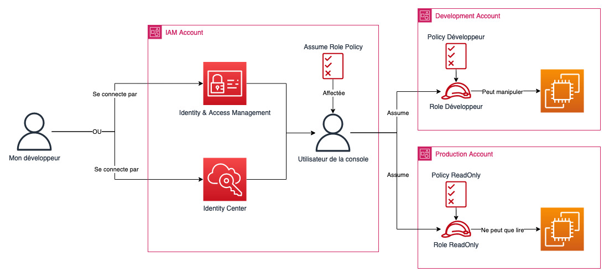

# Architecture Cloud

- [Architecture Cloud](#architecture-cloud)
  - [1. Le Cloud Computing c'est quoi ?](#1-le-cloud-computing-cest-quoi-)
    - [1.1. Définition](#11-définition)
    - [1.2. Cloud Computing VS On Premise Computing](#12-cloud-computing-vs-on-premise-computing)
    - [1.3. Caractéristiques principales du Cloud Computing](#13-caractéristiques-principales-du-cloud-computing)
    - [1.4. Cloud Publique, Privé et Hybride quelle différence](#14-cloud-publique-privé-et-hybride-quelle-différence)
    - [1.5. Les modèles de services dans le Cloud](#15-les-modèles-de-services-dans-le-cloud)
    - [1.7. Les différentes familles de ressources](#17-les-différentes-familles-de-ressources)
    - [1.8. Exemple d'utilisation dans un cadre professionnel](#18-exemple-dutilisation-dans-un-cadre-professionnel)
    - [1.9. Le portail AWS](#19-le-portail-aws)
  - [2. Deep dive dans les ressources d'un Cloud](#2-deep-dive-dans-les-ressources-dun-cloud)
    - [2.1. Les solutions de stockage](#21-les-solutions-de-stockage)
      - [2.1.1. Disques](#211-disques)
      - [2.1.2. Fichiers](#212-fichiers)
    - [2.2. Les ressources de Compute](#22-les-ressources-de-compute)
      - [2.2.1. Machines virtuelles](#221-machines-virtuelles)
      - [2.2.2. Conteneurs](#222-conteneurs)
      - [2.2.3. Fonctions](#223-fonctions)
    - [TP 1 : Monter un site web](#tp-1--monter-un-site-web)
  - [3. Le métier d'Ingénieur Cloud](#3-le-métier-dingénieur-cloud)
    - [3.1. C'est quoi le job d'un Ingénieur Cloud](#31-cest-quoi-le-job-dun-ingénieur-cloud)
    - [3.2. Pas mal de DevOps quand même](#32-pas-mal-de-devops-quand-même)
    - [3.3. Et t'es payé combien ?](#33-et-tes-payé-combien-)
    - [3.2. Les outils de l'Ingénieur Cloud](#32-les-outils-de-lingénieur-cloud)
  - [4 Le Well-Architected Framework l'outil premier de l'Ingénieur Cloud](#4-le-well-architected-framework-loutil-premier-de-lingénieur-cloud)
    - [4.1. Le pilier Operational Excellence](#41-le-pilier-operational-excellence)
    - [4.2. Le pilier Reliability](#42-le-pilier-reliability)
  - [5. Infrastructure as Code](#5-infrastructure-as-code)
    - [Avantages de l'Infrastructure as Code](#avantages-de-linfrastructure-as-code)
    - [Fonctionnement de Terraform](#fonctionnement-de-terraform)
    - [Créer une ressources dans terraform](#créer-une-ressources-dans-terraform)
    - [TP 2 : Déployer une infrastructure redondée et haute disponibilité avec Terraform](#tp-2--déployer-une-infrastructure-redondée-et-haute-disponibilité-avec-terraform)
  - [6. La sécurité dans le Cloud](#6-la-sécurité-dans-le-cloud)
    - [6.1. Le pilier de la Sécurité](#61-le-pilier-de-la-sécurité)
    - [6.2. Services de sécurité d'AWS](#62-services-de-sécurité-daws)
      - [Gestion des Accès et Identités](#gestion-des-accès-et-identités)
      - [Service de détection et de remédiation](#service-de-détection-et-de-remédiation)
      - [Sécurité réseaux et protection des applications](#sécurité-réseaux-et-protection-des-applications)
      - [Sécurisation des données](#sécurisation-des-données)
      - [Conformité](#conformité)
  - [7. Le métier d'Architecte Cloud](#7-le-métier-darchitecte-cloud)
    - [7.1. C'est quoi le job d'un Architecte Cloud](#71-cest-quoi-le-job-dun-architecte-cloud)
    - [7.2. Pas mal de politique quand même](#72-pas-mal-de-politique-quand-même)
    - [7.3. Et t'es payé combien ?](#73-et-tes-payé-combien-)
    - [7.2. Les outils de l'Architecte Cloud](#72-les-outils-de-larchitecte-cloud)
  - [8 Les piliers d'architecture](#8-les-piliers-darchitecture)
    - [8.1 Pilier Cost Optimization](#81-pilier-cost-optimization)
    - [8.2 Pilier Performance Efficiency](#82-pilier-performance-efficiency)
    - [8.3 Pilier Sustainability](#83-pilier-sustainability)
  - [9. Répondre à un besoin client](#9-répondre-à-un-besoin-client)
    - [TP 3 : Répondre à une besoin client en tant qu'Architecte et fournir une solution technique à ce besoin](#tp-3--répondre-à-une-besoin-client-en-tant-quarchitecte-et-fournir-une-solution-technique-à-ce-besoin)

(Jour 1)
## 1. Le Cloud Computing c'est quoi ?

### 1.1. Définition

Le [Cloud Computing](https://www.cnil.fr/fr/definition/cloud-computing) est un terme général désignant une mise à disposition de ressources informatiques à travers Internet par une organisation. Plus communément appelé `le Cloud`, il permet de payer à l'utilisation des serveurs ou services fournis par un fournisseur Cloud aussi appelé `Cloud Service Provider` ou `CSP`.

En simple, vous n'avez pas à acheter de serveurs ou d'appareils réseaux, vous louez et tout est géré par le CSP, on vous livre une majorité de services clé en main et prêt à être configurés en fonction de vos besoins. Pour exemple, le service le plus commun permet de déployer des machines virtuelles à la demande. Vous, en tant que client de ces CSP, allaient demander à provisionner une machine virtuelle sur votre compte avec les spécifications matérielles que vous choisissez et qui influencera le tarif. C'est ce qu'on appelle un service à la demande.

Mais du coup pourquoi avoir son infrastructure chez un CSP plutôt que d'avoir l'infrastructure `On Premise` ?

### 1.2. Cloud Computing VS On Premise Computing

Avoir son infrastructure On Premise signifie qu'on détient et maintient son propre système d'information dans un DataCenter ou un local informatique qui appartient à l'entreprise. Le matériel (serveurs, baies, racks, switch, ...) est acheté par l'entreprise à un instanté puis est remplacé tous les 3 ans en général, impliquant un coût à l’instanté fort. L'avantage premier est la responsabilité du matériel. Par exemple dans le cadre d'une activité sensible, géré sois même son infrastructure, connaître chaque niveau et maîtriser ses données est très important et n'est pas ou difficilement possible avec un CSP. Toutefois pour un StartUp acheter des serveurs et toute une infrastructure en ferais couler plus d'une avant même d'avoir commencer. Avec ce modèle vous achetez des serveurs à plusieurs milliers d'euros avec plus de capacité de prévu pour absorber "la charge". Ce qui signifie que vos serveur ne seront jamais rentabilisés à 100%. La maintenance est aussi détenu par l'entreprise ce qui requiert des compétences rares sur le marché de l'emploi et les métiers de l'informatique ne sont pas les moins bien payés. Tous ces facteurs entraînent plusieurs entreprises à ce poser la question de passer ou de commencer sur un CSP.

Avoir son infrastructure dans le Cloud, c'est contracter avec un CSP pour nous fournir des services informatiques en payant uniquement ce que nous consommons. Pour cela le CSP fourni son infrastructure sous forme de location qui permet à n'importe quel individu d'utiliser ses services à la demande. Ca nous permet par exemple de déployer une seule machine qui nous coûterai 10 Centimes d'euros de l'heure, et lorsque "la charge" augmente on peut en ajouter un second au même prix qui s'arrêtera juste après la montée de charge. Cette flexibilité et les prix agressifs sont les avantages principaux du Cloud, c'est ce qui rend ces outils très attractifs aux entreprises qui souhaitent se développer très vite (startup, scaleup) mais aussi aux plus grosses d'innover bien plus rapidement dans des domaines comme l'intelligence artificielle ou le mainframe qui sont extrêmement coûteux à faire On Premise.

### 1.3. Caractéristiques principales du Cloud Computing

Les caractéristiques principales du Cloud Computing sont donc :

- **La Flexibilité :** Pouvoir lancer une machine, un nouveau service, ou réaliser un PoC en quelques heures sans devoir acheter des serveurs ou développer de nouvelles fonctionnalités sur l'infrastructure existante.
- **Le Coût :** Le `pay as you go` est le modèle le plus connu des CSP et il permet de payer à la demande donc de réduire fortement les coûts. Attention ça peut être à double tranchant une bonne gestion du FinOps est très importante ou les coûts du Cloud dépasseront les coûts On Premise.
- **Les Fonctionnalités :** Un accès instantané à des ressources à l'autre bout du monde, des services qui seraient inaccessibles pour des entreprises de petites tailles comme l’intelligence artificielle ou l'HPC. 
- **Rapidité et agilité :** Déployer en quelques secondes une infrastructure complète du réseau à l'application, en quelques clics ou de façon complètement automatisée. 
  
>L'exemple parfait c'est le développement d'une application. Quand le développer va envoyer son code sur Git, une pipeline va déployer automatiquement une instance de l'application dans le Cloud pour que le développeur puisse la tester, ou tout simplement déployer en production automatiquement.

### 1.4. Cloud Publique, Privé et Hybride quelle différence

Maintenant qu'on sait à quel point le Cloud peut être un vecteur de croissance important pour les entreprises, il faut choisir un modèle de Cloud. Il en existe trois, chacun a ses propres avantages et s'adapte aux besoins de chaque entreprises.

Un Cloud public permet à n'importe quel individu de créer un compte et d'utiliser leurs ressources moyennant de mettre sa carte bleu. Ca nous donne accès aux réseaux les plus vastes du monde ainsi qu'un panel de services informatiques dont vous n'imaginez même pas qui peut en avoir besoin. Les plus connus sont : Amazon Web Services (AWS), Microsoft Azure, Google Cloud Computing (GCP) et en France OVH.

Un Cloud privé à contrario est géré aussi par un CSP mais qui ne met à disposition ses services qu'aux personnes morales (entreprises, associations, ...). Ces CSP disposent eux aussi de leurs propre DataCenter et sont souvent plus régionaux comme Cheops à Bordeaux ou Thalès et Dassault. Ils sont souvent plus spécialisés (mais pas toujours) et vont offrir des services dédiés à des industries comme la défense, ou le bancaire. Il arrive aussi que de grands groupes développent leurs propres CSP en interne pour servir leurs utilisateurs internes. `

Le dernier modèle c'est le Cloud Hybride. C'est le fait d'utiliser plusieurs Cloud Service Providers et de les faire interagir entre eux. Ca s'applique de privé vers publique, publique vers publique ou privé vers privé. Ca a de grands avantages car tous les CSP ne proposent pas les même fonctionnalités. Par exemple Microsoft Azure fourni la plupart des outils d'Active Directory par Microsoft Entra ID et est utilisé par de nombreuses entreprises pour se connecter à un autre provider comme AWS. L’intérêt aussi est de dupliquer son infrastructure ou ses données dans les DataCenter d'une autre entreprise. Ca permet de créer de la redondance en cas de DDoS ou juste d'accès aux données dans une région ou le CSP principal n'est pas déployé. 

Le modèle Hybride est souvent privilégié par les grands groupes tandis que l'utilisation d'un Cloud publique est souvent privilégié par des entités plus petites ou avec des besoins d’expansions rapide à moindre coût.S

### 1.5. Les modèles de services dans le Cloud

Dans le Cloud on utilise différents niveau de responsabilité de l'infrastructure par le bié de modèles dit `As a Service`. On en recense de plus en plus mais les trois qui nous intéressent sont les suivants :

**Infrastructure as a Service (IaaS) :** Ce modèle nous permet de gérer l'infrastructure jusqu'à l'OS. Il est majoritairement utilisé lorsqu'une machine virtuelle est impliquée dans le service. On va donc sélectionner l'hardware que l'on souhaite, sa connectivité réseau et ses disques et gérer tout ce qu'il se passe à partir de l'OS et le CSP n'interviendra pas à ce niveau.

**Platform as a Service (PaaS) :** Ce modèle rend abstrait la couche de l'OS et nous donne directement accès à l'application. Le CSP va donc gérer les mises à jour de l'OS et de l'hardware et voir même de l'application à la demande de l'administrateur. Ici que du clic clic fini les configurations Linux ou Windows. On retrouve ce modèle notamment sur les bases de données dites *managées* dans lesquels on va seulement interagir avec le moteur de base de données mais pas avec l'OS directement. On entend d'ailleurs souvent le terme `Managed instance` ou `Managed service`.

**Software as a Service (SaaS) :** Ce modèle est sûrement le plus commun sur internet, il permet à un utilisateur de consommer une application depuis n'importe quel appareil connecté et en général depuis un navigateur internet en contrepartie d'un abonnement. Ici le fournisseur va gérer les mises à jour, l'infrastructure et ne laissera à l'utilisateur que l'administration de l'application. Ce modèle on le retrouve par exemple chez Github, Elastic Cloud ou tout simplement les CSP Publiques qui fournissent l'accès à leurs services par le biais de ce modèle pour administrer les utilisateurs.

-> Exercice rapide : quel est le meilleur modèle pour le cas en face ?

### 1.7. Les différentes familles de ressources

Les CSP fournissent des `ressources`, qui correspondent à un service, une machine, un disque, ect. Il en existe des familles communes à la majorité :
- Compute : Machines virtuelles, conteneurs, fonctions.
- Stockage : Disques, fichiers, bases de données.
- Intelligence artificielle : LLM, VM dédiées ...
- Sécurité : Gestion des accès et droits (IAM), outils d'audit, guardrails, firewall ...
- Réseau : Cloud privé virtuels, table de routage, outils d'audit réseau, vpn ...

Et plein d'autres.

### 1.8. Exemple d'utilisation dans un cadre professionnel

Ici notre exemple montre l'organisation d'une application web basique avec un système de stockage de fichier qui sert de CDN, une vm front et back pour notre app, la sécurité mise en place autour et le WAF qui va protéger l'application des DDoS par exemple.

-> Montrer une schéma d'archi et expliquer le contexte et la mise en place quite à faire une démo basique de cette infra
### 1.9. Le portail AWS
-> Ils ne vont pas créer de compte je vais leur en fournir un comme ça pas de dépense chelou dans AWS pour eux avec un wipe des ressources le soir.

## 2. Deep dive dans les ressources d'un Cloud

On l'a vu un CSP peut avoir plein de familles de ressources mais les plus communes restent le stockage et le compute. Chez AWS ça ce manifeste par différentes solutions managées ou géré par vous et répondent à des besoins différents.

### 2.1. Les solutions de stockage
#### 2.1.1. Disques

Chez AWS les disques s'appellent EBS (Elastic Block Store). Ce service permet de fournir des disques persistants qui agissent comme des volumes attachés à votre VM. 

Grâce à EBS vous pouvez attacher ou détacher des disques pour les affecter à d'autre VM donc par exemple lors de la migration de version si vous avez stockés vos données sur un disques séparés du root disk vous pourrez le rattacher à la nouvelle VM à jour en quelques clics et presque sans interruption de service.

On peut aussi décider de choisir la performance du disque (SSD/HDD) et surtout l'I/O que vous pouvez envoyer dans le disque. Moins l'I/O est haut moins ce sera cher. Toutes les applications n'ont pas besoin d'un SSD on va donc économiser des sous sur ce genre de détails.

Comme sur n'importe quel fonctionnement avec des disques vous aurez la possibilité de faire des snapshot qui vous permettront des créer d'autre disques à partir du premier. Vous pourrez donc dupliquer une VM ou la faire revenir dans un état initial de la même façon qu'un conteneur.

#### 2.1.2. Fichiers

Chez AWS on retrouve deux service principaux : 

EFS : Elastic File Storage qui va vous permettre d'avoir un partage de fichier NFS entre des VM ou des conteneurs. Notamment utiles quand vous devez centraliser des logs ou si vous avez besoin de partager facilement des fichiers entre vos VM sans payer de VM dédiée.

S3 : Simple Storage Service est un des plus vieux d'AWS, il vous permet de stocker à des coût dérisoires des Terras de données. Ici on s'en sert beaucoup pour stocker des images pour s'en servir de CDN ou alors pour stocker les logs. C'est une solution pour un stockage à long terme et à moindre coût. Aussi S3 est un service Global ce qui signifie que n'importe quel ressource stockées dessus est accessible en quelques microsecondes à travers le globe. Très puissant lorsque vous avez une application disponible à travers le monde entier. Il permet aussi par exemple d'hoster un site web statique pratiquement gratuitement.

### 2.2. Les ressources de Compute
#### 2.2.1. Machines virtuelles

Les VM ici appelée par le service EC2 : Elastic Compute Cloud est le service le plus utilisé de la plateforme et un service que vous retrouverez chez n'importe quel provider. Il permet aux utilisateurs de louer des ressource de compute (ram, cpu, i/o) sur demande, ce qui leur permet de créer et de gérer des instances de serveurs virtuels dans le cloud. EC2 offre une flexibilité exceptionnelle en termes de choix de système d'exploitation, de type d'instance et de capacité de calcul, permettant aux utilisateurs de dimensionner rapidement leurs ressources en fonction de leurs besoins.

En le couplant avec d'autre services comme l'autoscaling on est capable de déployer des machines en fonction du trafic sur l'application ou les ressources consommées par la VM. Il a aussi un intégration étroite avec un grand panel de services comme S3 ou d'autre dont on parlera plus tard qui étant et permet aux applications d'être bien plus performantes.

#### 2.2.2. Conteneurs

ECS ou Elastic Container Service est les service de conteneur à la demande d'AWS. Il permet de déployer un conteneur full managé comme le ferais docker en local. Ici il se décline sous différentes formes pour s'intégrer avec Elastic Kubernetes Service, ou Fargate qui s'approche de docker swarm. Grâce à cette diversité vous pouvez déployer vos conteneur en quelques secondes ce qui est parfait pour une application avec une architecture microservice. Attention ECS est un service presque PaaS il est forcément plus onéreux que d'utiliser une instance EC2 et d'y mettre Docker mais vous demande bien moins de gestion donc à vous de voir ce qui est le plus propice à votre besoin.

#### 2.2.3. Fonctions

Les fonctions ou Lambda chez AWS sont sûrement quelque chose dont vous n'avez jamais entendu parler. Une Lambda c'est un script ou un bout de code exécuté en parallèle par des dizaines, centaines ou milliers de processus. Les fonctions sont très intéressantes pour du traitement de fichier comme des OCR ou pour scaler facilement des appels API. Cet outil est surtout utilisé lorsqu'une application est développée pour fonctionner avec le CSP et d'exploiter ses pleines capacités. Il existe donc des applications comme Amazon Prime Vidéo qui fonctionnaient principalement avec les Lambda mais depuis peu ils ont décidés de changer de paradigme de développement dû au coût élever des Lambda à cette échelle.

### TP 1 : Monter un site web

[TP1](./tp1/README.md)

## 3. Le métier d'Ingénieur Cloud
### 3.1. C'est quoi le job d'un Ingénieur Cloud

Un ingénieur Cloud c'est un métier de l'IT spécialisé dans la conception, le déploiement, la maintenance et l'optimisation de l'utilisation de resources informatique sur un CSP. Souvent l'ingénieur cloud est spécialisé dans un CSP du fait du nombre de services qu'ils proposent. Le job principal et de récupérer le schéma d'architecture cloud réalisé par l'Architecte Cloud et de le tester dans un environnement de test puis de développer à partir du schéma l'infrastructure et déployer, optimiser ses performance et son coût. Il est en suite en charge de maintenir cette infrastructure et de la faire évoluée au grès des besoins.

### 3.2. Pas mal de DevOps quand même

Ce métier est très lié au mouvement DevOps. Il est donc récurrent de voir qu'un Ingénieur Cloud est aussi DevOps. Souvent l'ingénieur cloud va aussi s'occuper de la partie CI/CD et donc automatiser les déploiement des applications dans le Cloud. Cette double casquette est aussi valable pour des SysAdmin ou pour des Ingénieurs réseaux mais le plus commun reste le DevOps.

### 3.3. Et t'es payé combien ?

En 2024, pour un junior donc en sortant d'école vous pouvez essayer de vous positionner autour de 37K euros brut/ans donc ça fait un peu plus de 2000€ par mois après impôts sans compté les avantages en nature de votre entreprise (ticket restos, PEE, Actions, primes, ect...). Attention ce chiffre est différents en fonctions de vos profils et des recruteurs mais c'est un minimum à visé correct en dessous ne prenez pas le job. Le maximum que vous pourrez espérer serait environ 40k à 42k pour les plus talentueux ou les plus chanceux ! Attention plus ne veut pas dire mieux. Si votre entreprise vous embauche à 42k mais que votre valeur sur le marché est trop haute personne ne voudra vous prendre à ce salaire alors faites attentions dans votre carrière à ne pas coûter trop cher ou personne ne voudra de vous dans les entreprises qui vous intéressent !

Le plus important c'est d'aller dans une entreprise qui vous plaît vous aurez plein d'offres toutes votre carrière mais pour ça répondez aux recruteurs et écoutez ce qu'ils ont à dire et sachez que vous pouvez **TOUJOURS** dire non avant de signer si vous avez mieux ailleurs.

Si vous voulez en savoir plus allez voir ce blog très intéressant : [Les salaires de la tech par Denis Germain](https://blog.zwindler.fr/2024/01/05/salaires-dans-la-tech-quelques-ressources-externes-2023-2024/)

### 3.2. Les outils de l'Ingénieur Cloud

L'ingénieur Cloud utilise différents outils, d'abord les outils de déploiement comme Terraform qui permet de développer et déployer l'infrastructure sur le CSP et Ansible qui permet de configurer les OS et applications. Puis pour permettre d'automatiser ces déploiement on utilise des CI/CD comme Github Actions, Jenkins et des outils de GitOps. Mais l'outil le plus important c'est les guides de bonnes pratiques pour créer une infrastructure dans le Cloud. Vous n'irez pas construire votre maison sans savoir si vous devez utiliser des tuiles ou de la taule pour votre toit ? Pour l'ingénieur Cloud c'est pareil sauf qu'on parler de plusieurs centaines de milliers d'euros voir millions alors on utilise des guides pour bien faire nos infrastructures. Le plus connus c'est celui d'Amazon : The Well-Architected Framework.

## 4 Le Well-Architected Framework l'outil premier de l'Ingénieur Cloud

Le [Well-Architected Framework](https://aws.amazon.com/architecture/well-architected/?wa-lens-whitepapers.sort-by=item.additionalFields.sortDate&wa-lens-whitepapers.sort-order=desc&wa-guidance-whitepapers.sort-by=item.additionalFields.sortDate&wa-guidance-whitepapers.sort-order=desc) est la bible des métiers du Cloud. Ce document existe aussi chez d'autre CSP mais ils se rejoignent tous sur ces six piliers :

- Operational Excellence
- Security
- Reliability
- Performance Efficiency
- Cost Optimization
- Sustainability

Il nous apporte les concepts clés et les bonnes pratiques d'une infrastructure dans le Cloud. Chaque pilier doit être respectés pour avoir une infrastructure la plus évolutive performante et économiquement viable car oui il est très facile de dépenser des milliers sans faire exprès. On va voir ensemble au fur et à mesures de nos séances les différents piliers.

### 4.1. Le pilier Operational Excellence

Le pilier Operational Excellence implique le fait de créer son infrastructure en utilisant les bonnes pratiques du CSP et de délivrer la meilleure expérience utilisateur. Il défini comment s'organiser, réfléchir son infrastructure, la scaler et la faire évoluer dans le temps.
On peut l'apparenter au principe DevOps d'amélioration continue. L'objectif avec ce pilier est de déployer des nouvelles fonctionnalités ou bug fix le plus rapidement et de façon sûr. 

Les objectifs du pilier :

**Faire de l'operations as code :** De la même façon que les développeurs codent leurs applications il en va de même pour l'infrastructure. On peut développer l'ensemble de l'infrastructure grâce à des outils comme Terraform pour pouvoir automatiser le déploiement et mettre à jour depuis le code. Grâce à l'Infrastructure as Code on réduit les erreurs humaines.

**Effectuez des modifications fréquentes, légères et réversibles :** Faire en sorte que l'infrastructure soit évolutive pour permettre une mise à jour indépendante de chaque composant. En automatisant les déploiement avec une CI/CD lors de modification mineures et incrémentielle on améliore le flux de déploiement et simplifie le rollback en cas de problème. On accroît ainsi la confiance dans l'infrastructure en prouvant la capacité à réagir rapidement aux besoins ou aux adversités imposée sur l'infrastructure.

**Améliorer régulièrement les procédures opérationnelles :** Faites évoluer vos procédures en fonction des changements que subissent vos workload. Tout en utilisant des procédures opérationnelles, cherchez le moyen de les améliorer. Passez régulièrement en revue les procédures et assurez-vous qu'elles sont efficaces et maîtrisées par les équipes. Lorsque des lacunes sont identifiées, actualisez les procédures en conséquence. Communiquez les mises à jour des procédures à toutes les parties prenantes et équipes.

**Anticiper les pannes :** Effectuez des exercices afin d'identifier les causes possibles de panne et de les supprimer ou de les atténuer. Testez vos scénarios de pannes et confirmez votre compréhension de leur impact. Testez vos procédures de réponse pour vous assurer qu'elles sont efficaces et que les équipes sont familiarisées avec leur exécution. Planifiez des simulations de pannes pour tester la capacité à traiter ces problèmes. 

**Utiliser des services managés :** Utiliser des ressources ou services managés par le CSP afin de réduire la charge opérationnelle des équipes.

**Monitorer efficacement :** Monitorer l'infrastructure afin d'en ressortir des informations exploitables pour maintenir le service et réagir en cas de pannes ou de problèmes. Faites-vous une idée précise du comportement, des performances, de la fiabilité, des coûts et de l'état de la charge de travail.

### 4.2. Le pilier Reliability

Le pilier Reliability fait référence à la fiabilité de l'infrastructure et de ses workloads (application, services, vm, ...). Ce pilier à pour but de nous apporter les bonnes pratiques lors de la réflexion des schéma d'architecture et lors de la mise en place de celle-ci.

**Redéploiement automatique après une panne :** En contrôlant les indicateurs clés de performance d'un workload, vous pouvez déclencher l'automatisation en cas de transgression d'un seuil. Cela permet la création de notifications automatiques, le suivi des pannes et l'exécution de processus de récupération automatique qui contournent ou corrigent les pannes. Une automatisation plus sophistiquée rend possible l'anticipation et la correction des pannes avant qu'elles ne se produisent. 

**Scaling horizontal :** Répartir la charge de la ressources sur plusieurs plus petites ressources pour ne pas créer un point d'échec unique (Single Point of Failure: SPoF) et plus facilement répondre aux pics d'activité.

**Gestion de la capacité :** une cause courante de panne des charges de travail sur site est la saturation des ressources, lorsque les demandes ciblant une charge de travail en dépassent la capacité (c'est souvent l'objectif des attaques par déni de service). Dans le cloud, vous pouvez contrôler la demande et l'utilisation de la charge de travail. Vous pouvez aussi automatiser l'ajout ou la suppression de ressources afin de maintenir le niveau optimal de satisfaction de la demande sans sur-allocation ou sous-allocation.

**Gérer les changements avec l'automatisation :** les modifications apportées à l'infrastructure doivent être appliquées via l'automatisation. Les modifications qui doivent être gérées incluent celles apportées à l'automatisation et qui peuvent ensuite être suivies et vérifiées. 

## 5. Infrastructure as Code

L'infrastructure as Code est une pratique permettant de déployer et gérer des ressources informatiques à travers des fichiers de configuration. On utilise ensuite des outils comme Terraform, AWS CloudFormation ou ARM chez Azure pour déployer ces fichiers et avoir un état identique entre nos fichier et nos ressources dans le Cloud. 

### Avantages de l'Infrastructure as Code

Les avantages principaux de l'Infrastructure as Code sont la réduction des coûts, la réduction des risques, la rapidité d'exécution et la collaboration avec votre équipe.

L'IaC permet de déployer rapidement l'état défini dans les fichiers de configuration. Lorsque le déploiement est enclenché, il n'y a aucune intervention humaine donc on réduit fortement le risque d'erreur. Étant donné que le déploiement est automatisé par l'outil il permet aussi de déployer rapidement les ressources dans le Cloud, parfait pour des équipes de développement qui veulent tester de nouvelles fonctionnalités de leurs apps ou tout simplement lors d'une panne la restauration en est simplifiée. Le dernier point intéressant est la suppression des ressources à la volée lorsqu'elle ne sont plus utiles, idéal pour les entreprises qui souhaite économiser lors des périodes d'inactivité.

L'utilisation de l'Infrastructure as Code aide à limiter les risques liés aux déploiements mal gérés en entreprise. En cas d'erreur lors d'un déploiement, il est facile de revenir en arrière rapidement grâce au versioning du code de l'infrastructure, qui fonctionne de la même façon que le versioning de code d'un app. De cette manière, les problèmes lors d'une mise à jour de l'app ou d'un fix de bug peuvent être résolus rapidement. En conséquence, les défauts logiciels sont moins susceptibles de persister dans le code, ce qui réduit les risques qui y sont associés.

Un dernier point, partiellement lié à la rapidité d'exécution et à la collaboration, concerne la reproductibilité : un même script peut être réutiliser en utilisant des variables, à déployer tous les environnements pour l'applicatif souhaité (production, préproduction, développement). Il est donc possible d'avoir des environnements totalement identiques sur le plan technique, et de tester en conditions réelles les applications déployées, sans perte de temps supplémentaire. 

### Fonctionnement de Terraform

Terraform est un outil d'Infrastructure as Code permettant de déployer une infrastructure dans le Cloud en l’occurrence AWS. Il existe des concurrents comme AWS CloudFormation ou Azure Ressource Manager. Terraform se présente sous la forme d'un outil en ligne de commande.

Terraform utilise le principe de `providers` qui sont des plugins permettant d’interagir avec les cli ou sdk des Cloud providers. Dans notre cas nous utiliserons le provider `AWS`. Dans chaque dossier contenant une infrastructure terraform on trouveras un fichier `provider.tf`. 

```tf
provider.tf

# Sélection du provider souhaité et de sa version
terraform {
  required_providers {
    aws = {
      source  = "hashicorp/aws"
      version = "~> 5.0"
    }
  }
}

# Configuration du provider qui correspond au fichiers dans ~/.aws/
provider "aws" {
  region  = "eu-west-1"
  profile = "default"
}
```

Les quatres commande principales de terraform sont : 

**terraform init :** Cette commande permet d'initialiser le répertoire courant comme contenant des fichiers de configuration de Terraform. C'est la première commande à taper elle permet aussi de télécharger les providers Terraform.

**terraform plan :** Cette commande permet de visualiser les changement qui vont être opérés sur l'infrastructure.

**terraform apply :** Cette commande permet de visualiser puis appliquer les changement qui vont être opérés sur l'infrastructure.

**terraform destroy :** Cette commande permet de visualiser puis supprimer les changement qui vont être opérés sur l'infrastructure.

### Créer une ressources dans terraform

Maintenant que nous avons notre fichier provider et que nous connaissons les commandes de bases, il faut créer les premiers fichiers. Pour cela on va aller sur la documentation du registry Terraform correspondant à notre provider en l’occurrence AWS.

> https://registry.terraform.io/providers/hashicorp/aws/latest

Pour créer une ressource on va utiliser un fichier en `.tf`. On retrouvera souvent un fichier par type de ressource pour ne pas se mélanger donc par exemple : `ec2.tf`, `s3.tf` ou un fichier `main.tf` qui regroupe tout si vous le souhaitez mais ce n'est pas conseillé. Vous pouvez trier aussi par usage : `instance.tf`, `security.tf` ...


Terraform comprend trois mots clés principaux :

- resource : correspond à une ressource fourni par le provider 
- variable : une variable défini qui nous permet de réutiliser des valeurs à travers nos fichiers .tf
- output : permet d'afficher après l'exécution du déploiement des valeurs fournis par des ressources comme les ip publiques ou le dns du load balancer.

Ici je vais créer un security group et 2 règles:

```terraform
# Je sélectionne la resource aws_security_group et lui affecter un nom et un vpc id trouvable dans la console
resource "aws_security_group" "webserver_sg" {
  name   = "sg_webserver_lucaserisset"
  vpc_id = var.vpc_id
}

# Je peux créer cette ressource qui correspond à une règle dans le security group ou la créer à part comme ici
resource "aws_vpc_security_group_egress_rule" "egress_any" {
  # ici avec aws_security_group.webserver_sg.id je fais référence à la valeur .id que la ressource expose en output.
  security_group_id = aws_security_group.webserver_sg.id

  cidr_ipv4   = "0.0.0.0/0"
  ip_protocol = -1
}

resource "aws_vpc_security_group_ingress_rule" "ingress_ssh" {
  security_group_id = aws_security_group.webserver_sg.id

  # Chaque valeur qu'on voit ici sont documentées dans la page dédié à la ressource
  cidr_ipv4   = "0.0.0.0/0"
  from_port   = 22
  ip_protocol = "tcp"
  to_port     = 22
}
```

### TP 2 : Déployer une infrastructure redondée et haute disponibilité avec Terraform

[TP2](./tp2/README.md)

## 6. La sécurité dans le Cloud

La sécurité dans le Cloud fait référence aux bonnes pratiques, règles, contrôles et outils de cybersécurité pour protéger l'infrastructure, les données et les applications hébergés dans le Cloud. Chaque CSP peut vous fournir des outils de sécurité par le biais de services managés (Gestion des identités et accès, outils d'audit, firewall applicatifs, security groups,...). Dans le Cloud pas besoin de gérer la sécurité avec un niveau aussi bas que dans une infrastructure On Premise. En effet ici la sécurité du DataCenter donc physique est géré par le provider. La responsabilité de la sécurité réseau et du stockage est elle réparti entre le provider et son client. En effet le matériel (switch, firewall,...) est géré par le CSP donc sécurisé par le CSP mais l'interconnexion réseau entre vos ressources comme des VM reste de votre fait en tant que client car ça dépend de votre utilité. Pour le stockage même si le CSP va vous assurer l’intégrité de vos données et la non compromissions de celles-ci sur leurs disques cela dépend tout de même de votre choix de chiffrer vos données ainsi que comment vous les exposez à vos consommateurs (applications, utilisateurs,...). Un CSP ne sera pas responsable de votre mauvaise gestion des security group permettant à un attaquant de se propager entre vos machines ou s'il est capable de fuiter vos données client car vous n'avez pas chiffrer ces données. A l'opposé le CSP sera responsable si sur les disques décommissionnés vos données sont toujours présente dessus.

Pour vous aider à appliquer de la sécurité sur vos infrastructure les CSP on donc recours à des services internes mais aussi externe par le biais d'entreprise spécialisées en solution de sécurité. Par exemple le CSP peut vous fournir un WAF (Web Application Firewall) pour protéger vos infrastructure des acteurs malveillant attaquant vos sites. Ces outils sont équipés de premières protections mais doivent être personnalisés en fonction de vos besoin et vous permettent d'assurer la sécurité de vos applicatifs. Cette fois-ci l'usage de service managés sont très conseillés voir obligatoire pour faire fonctionner vos comptes dans le Cloud (ex: IAM le service de gestion des droits et utilisateurs). 

### 6.1. Le pilier de la Sécurité

Le pilier sécurité a pour objectif de vous démontrer comment utiliser le Cloud pour améliorer la sécurité de vos données, systèmes, et assets. Il vous accompagne dans la gestion de la Gouvernance de l'entreprise pour tirer les pleines capacités des outils d'analyse de votre CSP, la gestion des risques avec des outils de réplication multi-région de vos données ou encore les best practices sécurité de chaque services de votre CSP. Ce pilier sera autant utile aux Ingénieurs Sécurité, le RSSI, les Ingénieurs Cloud mais aussi votre SOC (Security Operational Center) et vos architectes logiciel.

**Mettre en place une solide base pour le contrôle des identités :** Utiliser le principe du moindre privilège (donner uniquement les droits strictement nécessaire pour l'utilisateur, le service,...), centraliser la gestion des identités et faire un roulement dans les accès programmatiques des outils et utilisateurs au CSP.

**Assurer la traçabilité :** Supervisez, alertez et contrôlez les actions et les modifications apportées à votre environnement en temps réel. Intégrez la collecte des journaux et des métriques aux systèmes pour effectuer des analyses et prendre des mesures automatiquement.

**Appliquer la sécurité à toutes les niveaux du SI :** Faites de la défense en profondeur, c'est à dire identifier et sécuriser chaque composants de votre SI de façon indépendante. Avec cette méthode on applique un maximum de sécurité sur chaque composants du SI : sous-réseaux, application, services managés, chaque instances, chaque disques. Chacun des composants de votre SI doit être sécurisé sans faire confiances aux composants autour de lui. 

Exemple : On ne peut pas se fier à ce que la connexion entre la DB et une Instance sera sécurisé juste parce-que la base de données a un mot de passe et que la VM est sur un subnet non connecté à internet. Il faut que les deux instances ne puissent se parler qu'entre elles et que la communication soit chiffrée ce qui éliminera le risque d'une attaque "man in the middle" qui permet à un attaquant de récupérer les communications entre 2 VM.

**Automatiser les bonnes pratiques en matière de sécurité :** Automatiser les tests de sécurité sur votre application ou l'Infrastructure as Code depuis vos pipelines CI/CD de votre Git. Automatisez les mises à jours de sécurité sur vos serveurs et les backup/réplications de vos données.

**Protéger les données in transit et at rest :** Chiffrez vos données. Qu'elles soient en transit entre deux machines par l'utilisation d'un certificat TLS ou lorsqu'elles sont sur un espace de stockage (disque, stockage blob,...) avec des clés de chiffrement. La fuite de données impacte la réputation de votre entreprise et surtout vous car VOUS êtes le seul métier avec la capacité de chiffrer ces données et empêcher ce genre d'attaques.

**Éviter les interventions humaines sur les données :** Utilisez des mécanismes et outils pour réduire ou éliminer le besoin d'accès direct ou le traitement manuel des données. Cette approche permet de réduire les risques de mauvaise manipulation ou de modification ainsi que les erreurs humaines lors d'interventions sur des données sensibles.

**Se préparer aux incidents de sécurité :** Préparez-vous à un incident en mettant en œuvre une stratégie et des processus de gestion et d'investigation des incidents. Exécutez des exercices de réponse aux incidents et utilisez des outils d'automatisation et monitoring pour améliorer votre vitesse de détection, d'investigation et de récupération.

### 6.2. Services de sécurité d'AWS

#### Gestion des Accès et Identités

Sur chaque infrastructure Cloud vous devrez avoir une porte d'entrée avec un utilisateur. Sur AWS cette porte se présente sous la forme de 2 services : Identity Center (Le SSO qui permet de gérer les droits de façon centralisé avec un Active directory par exemple) et Identity & Access Management (IAM)

**IAM :** C'est l'outil de gestion de droits et des identités que vous retrouverez chez tous les CSP. En l’occurrence sur AWS il vous permet de gérer les utilisateurs, groupes et rôles auxquels vous définirez des droits par le biais de policies (politiques de sécurité).

Sur AWS on retrouve 2 types d'identités :

**user :** Un utilisateur est une identité qui peut avoir un accès à la console ou un accès programmatique et qui peut être accédé par le biais d'un mot de passe ou de clés d'accès. Un utilisateur est souvent humain ou un compte de services utilisé par un logiciel pour manipuler des ressources AWS.

**role :** Un role est une identité qui est assumée/endossée par un utilisateur pour avoir accès à des droits sur des ressources AWS et les manipuler. Il ne détient pas de mot de passes ou clés mais contient une policy définissant qui peut l'endosser.

En général sur AWS on a un compte AWS dédié à la gestion des accès qui va concentrer tous les utilisateurs de l'infrastructure. Soit par le biais d'un SSO, Active Directory ou directement sur IAM. Ces utilisateurs vont ensuite vouloir se déplacer sur un autre compte et pour ça ils vont assumer un rôle présent sur ce compte et pouvoir manipuler les ressources. Un utilisateur ne permet pas de se déplacer entre les comptes alors on utilise des roles. Cela permet aussi d'appliquer le principe de moindre privilège pour limiter l'utilisateur dans ses droits sur certains comptes. Exemple on ne veut pas qu'un développeur puisse modifier de la production mais modifier l'environnement de développement oui donc il aura un role ReadOnly sur le compte de production et un role de Développeur sur le compte de développement.



#### Service de détection et de remédiation

**Amazon GuardDuty :** AWS GuardDuty est un service de détection de menaces managé qui analyse continuellement les logs et le trafic réseau des comptes AWS, identifiant ainsi les comportements suspects ou malveillants pour renforcer la sécurité des environnements cloud.

**Amazon Inspector :** Inspector est outil qui permet d'analyser les vulnérabilités dans les conteneurs et les VM. Il détecte les CVE (Common Vulnerability and Exposure) qui correspondent à des failles de sécurité dans des packages Linux, npm, Windows,... Grâce à cet outil vous pouvez savoir si votre serveur est vulnérable à une faille de sécurité et si vous pouvez la corriger. Parfait pour de la veille, couplé avec d'autre service il est possible de remédier automatiquement les packets avec des failles.

**AWS Config :** AWS Config est un service qui permet de suivre les configurations des ressources AWS et de détecter les écarts par rapport aux règles définies, offrant ainsi une visibilité et un contrôle continus sur l'état des ressources et leur conformité aux meilleures pratiques de sécurité.

**AWS CloudTrail :** AWS CloudTrail est un service qui permet de suivre et d'enregistrer les activités des comptes AWS, offrant une visibilité détaillée sur les actions effectuées, les ressources utilisées et les modifications apportées, afin de garantir la conformité, la sécurité et la traçabilité des opérations dans l'environnement cloud AWS.

**AWS CloudWatch :** AWS CloudWatch est un service de monitoring et de gestion des ressources AWS, permettant de collecter, de visualiser et d'analyser les données de performance et les journaux d'activité, ainsi que de déclencher des actions automatiques en réponse à des événements, offrant ainsi une supervision proactive et des alertes personnalisables pour garantir la disponibilité et les performances des applications dans le cloud AWS.

#### Sécurité réseaux et protection des applications

**AWS Firewall Manager :** AWS Firewall Manager est un service qui permet de gérer les règles de pare-feu dans plusieurs comptes et régions AWS, facilitant ainsi la mise en place de politiques de sécurité cohérentes et centralisées pour protéger les ressources cloud, et assurant ainsi une conformité aux normes de sécurité et une gestion simplifiée des politiques de sécurité dans un environnement AWS distribué.

**AWS Network Firewall :** AWS Network Firewall est un service managé qui fournit un pare-feu réseau évolutif et hautement disponible pour protéger les ressources dans un VPC AWS. Il offre un contrôle granulaire sur le trafic entrant et sortant, ainsi que des fonctionnalités avancées de surveillance et de gestion des menaces pour renforcer la sécurité des applications déployées dans le cloud AWS.

**AWS WAF :** AWS WAF est un service de pare-feu d'application web qui permet de contrôler et de filtrer le trafic HTTP/HTTPS entrant vers des applications web hébergées sur AWS, en protégeant contre les attaques courantes telles que les injections SQL, les attaques XSS et les attaques par déni de service distribué (DDoS), grâce à des règles personnalisables et à des deny list de bot et d'IP connus avec des règles prédéfinies.

#### Sécurisation des données

**AWS Key Management Service (KMS) :** AWS Key Management Service (KMS) est un service de gestion des clés de chiffrement qui permet de créer, de contrôler et de gérer facilement les clés de chiffrement utilisées pour protéger les données dans les services AWS et les applications. Il offre une gestion centralisée des clés, une intégration transparente avec d'autres services AWS, et permet de répondre aux exigences de conformité en matière de sécurité des données.

**AWS Certificate Manager :** AWS Certificate Manager (ACM) est un service qui simplifie le processus de gestion des certificats SSL/TLS pour les ressources déployées sur AWS, offrant des certificats gratuits et gérés automatiquement, une intégration transparente avec les services AWS, et permettant de sécuriser les communications HTTPS de manière fiable et évolutive.

**AWS CloudHSM :** AWS CloudHSM est un service de sécurité qui fournit des modules matériels de sécurité (HSM) dédiés pour stocker et gérer les clés de chiffrement de manière sécurisée dans le cloud AWS, offrant ainsi un contrôle total sur les clés sensibles, une conformité aux normes de sécurité et une protection renforcée des données sensibles contre les accès non autorisés.

**AWS Secret Manager :** AWS Secret Manager est un service de gestion sécurisée des secrets, permettant de stocker, de gérer et de récupérer facilement des informations sensibles telles que des clés d'API, des mots de passe et des certificats, offrant ainsi une solution centralisée et sécurisée pour la gestion des secrets dans les applications déployées sur AWS.

**Amazon Macie :** Amazon Macie est un service de sécurité qui utilise le machine learning pour identifier, classer et protéger les données sensibles dans les environnements AWS, offrant une visibilité et un contrôle sur les données sensibles, les activités anormales et les menaces potentielles, afin de renforcer la conformité et la sécurité des données dans le cloud AWS.

#### Conformité

**AWS Artifact :** AWS Artifact est un service qui fournit un accès sécurisé aux documents de conformité AWS, tels que les rapports d'audit, les attestations de conformité et les certifications de sécurité, permettant aux clients d'obtenir facilement et en toute confiance les informations nécessaires pour répondre à leurs exigences de conformité et de réglementation dans le cloud AWS.

**AWS Audit Manager :** AWS Audit Manager est un service qui automatise et simplifie le processus de gestion des audits de conformité dans AWS, permettant aux entreprises de collecter, de gérer et de gérer efficacement les preuves d'audit pour répondre aux exigences de conformité réglementaire et aux meilleures pratiques de sécurité.

## 7. Le métier d'Architecte Cloud
### 7.1. C'est quoi le job d'un Architecte Cloud

Un Architecte Cloud est un métier de l'IT spécialiser dans le Cloud. Architecte est un métier qu'on retrouve dans beaucoup de spécialité en informatique (Développement, Réseau, Infrastructure, Cloud,...). Ce métier est souvent une évolution du métier d'ingénieur qui lui correspond. Ici l'architecte Cloud est majoritairement un Ingénieur Cloud Senior qui devient Architecte Cloud. Il est assez commun que l'Architecte Cloud soit aussi le team lead des ingénieurs Cloud, il aura donc de la gestion de projet et de ses équipes dans son éventail de compétences.

L'Architecte Cloud est responsable de la stratégie Cloud de l'entreprise. Il a donc pour mission de designer les infrastructures Cloud, le design d'application cloud-native, les stratégies de monitoring et surtout de l'adoption du cloud par l'entreprise et ses produits.

**Adoption du Cloud :** L'Architecte a pour objectif de faire migrer et d'accompagner les produits qui ne sont pas dans le cloud tout au long de leur cycle de vie (et de continuer avec celle déjà dans le Cloud). L'adoption du cloud est un changement radicale dans la stratégie d'entreprise et requiert un changement de paradigme de développement des applicatifs et des infrastructures. Un dernier aspect est aussi que l'Architecte doit être capable de communiquer facilement avec le CSP afin de faire comprendre ses besoins et trouver les solutions les plus adaptées.

**Design d'infrastructure Cloud-native :** Après l'adoption du Cloud l'Architecte doit initier le processus de migration en proposant des schémas d'architecture de l'infrastructure qui soutiendra l'app mais aussi de comment l'application interagira avec les services du CSP (Gestion des accès, connexion aux DB ou services de stockage,...). Ces schéma sont réalisés pour permettre aux différentes parties prenantes du projet de comprendre comment l'application fonctionnera dans le Cloud.

**Monitoring du Cloud en fonction des KPI :** L'architecte étant plus près des managers, il a aussi la responsabilité de rendre compte de l'état de l'infrastructure (coût, performance, taux de risque sécurité,...) et doit donc monitorer l'infrastructure en fonction des KPI définis avec son management et ses équipes. 

Un autre role de l'architecte c'est aussi la veille, il doit toujours être au courant des dernières sorties du CSP pour étudier si il est intéressant d'intégrer à son infrastructure ces nouveaux composants. Mais surtout il devra rédiger des Proof Of Concept ou PoC qui serviront de prototypes à de nouveaux projet et en ressortir un compte rendu de l'état de celui-ci. Aucun projet ne peut commencer sans un PoC et un compte rendu ou vous créerai de la dette technique 5 ans plus tard qui seront difficilement rattrapable.

### 7.2. Pas mal de politique quand même

Dans ce métier la politique fait partie du quotidien. Quand on commence à parler à des managers et d'objectifs de son équipe au sens large il y aura des débats entre architectes et managers sur les choix architecturaux et des compromis devront être fait dans chaque parties prenantes du projet. C'est très présent dans les grands groupes notamment dû à l'historique des infrastructures et usages. Il faut donc être prêt à vendre ses schémas et projets sans se laisser marcher sur les pieds et garder l'intégrité du projet tout en ayant des deadlines cohérentes. C'est une partie du métier qu'on apprend pas à l'école et qui est souvent négligé mais très importante.

### 7.3. Et t'es payé combien ?

Toujours en prenant compte de l’excellent article [Les salaires de la tech par Denis Germain](https://blog.zwindler.fr/2024/01/05/salaires-dans-la-tech-quelques-ressources-externes-2023-2024/), on peut estimer que l'Architecte Cloud gagne autour de 60 à 70k € par an au bout de 10 ans de carrière. Il faut garder en tête que vous pourriez être architecte à 26 ans et vous auriez un gap de salaire important en tant qu'ingé cloud qui devient architecte mais vous ne serez peut être pas à 60k. En effet votre salaire dans la tech est plus lié au nombre d'entreprises que vous avez fait (des bonds de salaire entre elles) mais surtout vos années d'expériences dans le domaine. En tant qu'alternant vous avez la chance de commencer avec quelques années d'expériences même si malheureusement *beaucoup de recruteurs* vous diront que ça ne compte pas. **N'en tenez pas compte c'est une grande force !**

### 7.2. Les outils de l'Architecte Cloud

Les outils principaux de l'architecte Cloud sont donc les suivants :

**The Well-Architected Framework :** Le Well-Architected Framework, est utilisé autant par l'Ingénieur Cloud que l'Architecte Cloud puisqu'il recense toutes les bonnes pratiques d'un Cloud Provider et de l'utilisation de ses services. Toutefois pour l'Architecte il est primordial qu'il applique chaque pilier et qu'il les connaisse. Son rôle est aussi de conseiller les équipes dans l'adoption et doit répondre à ses supérieurs en cas de problème il lui incombe donc plus de responsabilité que le Well-Architected Framework peut aider à solutionner. Il est donc son outils principal.

**Une suite documentaire :** Google Workspace ou Microsoft 365, peu importe mais vous allez devoir travailler souvent sur des classeurs (Sheets/Excel) pour de l'analyse de coût/performance, des document (Docs/Word) pour rédiger des document d'architecture ou des comptes rendus par exemple ou encore des diapositives (Slides/PowerPoint) pour présenter aux équipes/management les architectures et les proposition d'évolutions de l'infrastructure par exemple.

**Un outil de schématisation :** Le plus connu reste Draw.io qui est un outil de visualisation et de création de schéma en tout genre : Architecture Cloud (AWS, Azure, GCP), Schéma réseaux, de bâtiments ou même des UML et des processus. Cet outil quel qu'il soit devra être maîtrisé pour proposer rapidement des schémas de vos nouveaux produits ou évolution de ceux-ci. Par exemple dans le cours tous les schémas sont réalisés selon les recommendations AWS sur Draw.io qui contient déjà des outils intégré (logos des services AWS, assets AWS,...) pour réaliser des schémas AWS.

**Les outils de l'ingé cloud :** Évidement le dernier reste le CSP et toutes les technos utilisés par l'ingénieur Cloud. Vous gardez souvent la main sur l'infrastructure en renforçant vos équipes sur des sujets plus complexe dont vous avez l'expérience de gérer. Vous continuerai donc l'IaC, l'utilisation du CSP et surtout le Well-Architected Framework.

## 8 Les piliers d'architecture
### 8.1 Pilier Cost Optimization

L'optimisation du coût d'une ressource implique qu'elle utilise pleinement les capacités qu'on lui offre pour un prix le plus abordable possible tout en matchant les minimum requirement. Ce pilier a pour but de vous guider dans la réduction des coût de votre infrastructure car la facture dans le Cloud peut vite dégénérer si l'optimisation est mal gérée. Une branche de métier existe désormais, spécialisé dans ce domaine, les FinOps.

**Mettez en œuvre la gestion financière du cloud :** L'idée principale du Cloud c'est d'accélérer la croissance des produits et donc la rentabilité qui vient avec. Mais pour cela il faut investir dans le Cloud par des compétences, des formations, et des ressources humaines spécialisées dans le domaine. C'est seulement en suivant ce chemin que votre entreprise peut devenir plus efficace dans la gestion de ses coûts. 

**Adopter un modèle de consommation :** Ne payer que pour ce dont vous avez besoin. Le `pay as you go` est le modèle phare du Cloud mais il existe aussi d'autre modèle parfois plus économique comme la réservation d'instances sur 2 ou 3 ans qui vous permet d'économiser plusieurs mois de coût des ressources. Toutefois vous devez gardez en tête qu'avec ce modèle si vous n'utilisez pas les ressources réservées vous les paierais quand même. Aussi éteignez vos machines si elles ne sont pas utilisées ou baisser le nombre nécessaire lors des périodes de trafic plus bas.

**Mesurer l'efficacité globale :** Mesurez l'impact sur le business de chaque workload, chaque ressources sur les coûts du quotidien (création, maintenance, livraison). Grâce à ces mesures vous serez capable de comprendre les gains que vous faites en améliorant des fonctionnalités, améliorant la valeur de la machine et en réduisant ses coûts.

**Analysez et répartissez les dépenses :** Grâce à la nature du Cloud qui permet de connaître le coût de chaque service, il est plus facile d'identifier quels projets coûtent combien. Vous pouvez donc optimiser vos coûts répartissant entre les équipes la charge financière associé à leurs projets. 

### 8.2 Pilier Performance Efficiency

Utilisez les données récupérés grâce aux autre piliers afin de concevoir des infrastructure haute performance. Du schéma d'architecture au choix du type d'instances, vous devez par le biais de ces données être capable de produire une infrastructure la plus performante possible. Il faudra faire des compromis sur l'architecture de l'infrastructure pour améliorer les performances avec l'utilisation de cache ou compression et être plus souple sur certains aspects de sécurité ou financiers.

**Démocratiser les technologies avancées :** Utilisez les outils plus avancés fourni par le CSP pour vous simplifier la mise en place et la maintenance du produit. Plutôt que d'apprendre à gérer une nouvelle technologie utilisez plutôt un service managé qui vous délaisse de la maintenance opérationnelle pour vous concentrer sur le développement de nouveaux produits. 

**Une envergure mondiale en quelques minutes :** Déployez vos ressources à travers le monde pour profiter de l'implémentation mondiale du CSP. Si vous avez des clients en Asie, considérez l'utilisation de ressources proche de vos utilisateurs ou de solutions qui permettent un trafic rapide entre l'Asie et l'Europe.

**Utiliser des architectures serverless :** Utiliser du serverless c'est à dire développer une application cloud-native qui va utiliser les fonctions (Lambda), des gateway API fournis par le CSP afin de réduire la latence et accroître la performance mais ça a un coût ! Par exemple vous pouvez convertir un site web en utilisant des technologies serverless pour le web et donc ne plus avoir de serveurs ou conteneurs à gérer.

**Expérimenter plus fréquemment :** Expérimenter plus souvent de nouvelles technologies. Cela vous permettra d'avoir une meilleure vision des services proposés par le CSP et de mieux définir vos futures architectures.

**Envisager la « sympathie mécanique » :** Sélectionner du matériel adapté à vos besoin comme par exemple choisir une instance dédié aux bases de données pour une DB ou une instance avec un GPU pour des workload de DeepLearning.

### 8.3 Pilier Sustainability

La pilier Sustainability ou développement durable (durabilité) en français traite des répercussions environnementales, économiques et sociétales à long terme de vos activités commerciales. La Commission mondiale sur l'environnement et le développement des Nations Unies définit le développement durable comme « un développement qui répond aux besoins du présent sans compromettre la capacité des générations futures à satisfaire les leur ». Votre entreprise ou organisation peut avoir des impacts environnementaux négatifs, tels que des émissions carbone directes ou indirectes, des déchets non recyclables et des dommages causés aux ressources partagées comme l'eau potable.

Lorsque des ressources sont créées dans le cloud, le pilier Sustainability permet de comprendre les impacts des services utilisés, mesurer les impacts tout au long du cycle de vie de la ressource dans son ensemble et appliquer des principes d'Architecture et de bonnes pratiques afin de réduire ces impacts. Ce pilier se concentre sur les impacts environnementaux, notamment la consommation et l'efficacité énergétiques, qui sont des leviers importants permettant aux architectes de recueillir des informations sur les actions directes afin d'utiliser moins de ressources. 

**Déterminer votre impact :** Mesurez l'impact de vos ressources dans le cloud et modélisez l'impact futur de vos workload. Incluez toutes les sources d'impact, y compris les impacts résultant de l'utilisation de vos produits par les clients, et ceux découlant de leur éventuelle mise hors service. Comparez le rendement productif à l'impact total de vos workload sur le cloud en évaluant les ressources et les émissions nécessaires par unité de travail. Utilisez ces données pour établir des indicateurs clés de performance (KPI), évaluer des moyens d'améliorer la productivité tout en réduisant l'impact et estimer l'impact des changements proposés au fil du temps. 

**Définir des objectifs de durabilité :** Pour chaque ressources dans le cloud, établissez des objectifs de durabilité à long terme, tels que la réduction des ressources de calcul et de stockage nécessaires par opérations. Modélisez le retour sur investissement des améliorations durables pour les workload existants et donnez aux équipes les ressources dont ils ont besoin pour investir dans leurs objectifs de durabilité. Planifiez en vue d'une croissance et concevez l'architecture afin que la croissance entraîne une intensité de l'impact moindre mesurée par rapport à une unité appropriée, par utilisateur ou par transaction par exemple. Les objectifs vous aident à soutenir les objectifs de développement durable plus larges de votre entreprise ou organisation, identifier les régressions et privilégier les zones pouvant être améliorées. 

**Optimiser l'utilisation des ressources :** Dimensionnez correctement les ressources et intégrez une conception efficace pour assurer une forte utilisation et optimiser l'efficacité énergétique du matériel sous-jacent (et optimiser les coûts). Deux hôtes s'exécutant à 30 % de leur utilisation sont moins efficaces qu'un seul hôte s'exécutant à 60 % du fait de la consommation énergétique de base par hôte. Éliminez ou minimisez également les ressources, le traitement et le stockage inactifs afin de réduire l'énergie totale nécessaire pour alimenter votre charge de travail. 

**Anticiper et adopter des offres matérielles et logicielles neuves et plus efficaces :** Contrôlez et évaluez de façon continue des offres matérielles et logicielles neuves et plus efficaces. Concevez de manière flexible afin de permettre l'adoption rapide de nouvelles technologies efficaces. L'exemple parfait c'est la croissance sur le marché des processeurs ARM qui deviennent très puissant voir plus puissant qu'une architecture amd64. On le voit notamment chez AWS avec leurs processeurs `graviton` qui en plus d'être moins cher sont bien plus puissant que les processeur qu'on peut retrouver sur des types d'instances standards


## 9. Répondre à un besoin client

Le meilleur moyen pour répondre à un besoin client c'est de suivre les étapes suivantes :

1. Décortiquer le sujet en retenant les mots clés du document et les points sur lesquels le client insiste. Ces points sont votre priorité et ce sur quoi le client vous attend lors de votre proposition.

2. Les exigences du Client s'intègrent toujours dans un contexte. Et vous devez toujours suivre ce contexte et vous demander si vos propositions vont dans le sens du contexte sans quoi vous serez hors-sujet.

3. Identifiez les besoins implicites qui ne sont pas explicitement mentionnés dans le sujet. Cela peut nécessiter de lire entre les lignes pour comprendre les attentes du client.

4. Divisez le sujet écrit en éléments plus petits et plus gérables. Identifiez les différentes parties du sujet qui peuvent correspondre à des fonctionnalités distinctes ou à des aspects spécifiques du projet.

5. Relevez toute ambiguïté ou toute information manquante dans le sujet écrit et cherchez à obtenir des éclaircissements auprès du client. Cela peut nécessiter des échanges de questions-réponses ou des réunions de clarification.

6. Une fois que vous avez une compréhension initiale des besoins à partir du sujet écrit, discutez-en avec le client pour vous assurer que vous avez interprété correctement ses attentes. Cela peut aider à éviter les malentendus et les erreurs de communication. N'hésitez pas à le faire avant la date butoir de la présentation.

7. Documentez soigneusement les exigences identifiées à partir du sujet écrit, en les décrivant de manière claire, concise et non ambiguë. Utilisez des outils tels que des diagrammes, schémas d'architecture, des listes de fonctionnalités ou des descriptions textuelles pour organiser les informations.

8. Assurez-vous de maintenir une communication continue avec le client tout au long du processus d'analyse des besoins pour vous assurer que vous êtes sur la bonne voie et pour permettre des ajustements si nécessaire.

### TP 3 : Répondre à une besoin client en tant qu'Architecte et fournir une solution technique à ce besoin 

