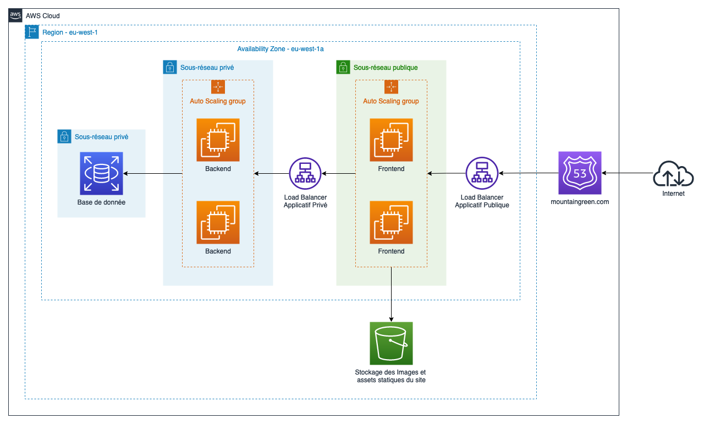

# TP2 Déployer une infrastructure Web avec terraform

## Rendu attendu
- Une présentation PowerPoint expliquant la/les solutions proposées
- Un schéma d'architecture de la/des solutions proposées réalisé sur `draw.io` avec les icônes AWS
  
> **Tips sur les schémas :** n'essayez pas de tout faire rentrer sur un schéma ce n'est pas possible, à la place produisez un schéma simplifié puis faites d'autre petits schémas qui viendront préciser son fonctionnement.

## Notation
- Faisabilité du schéma /5
- Compréhension des besoins client /5
- Pertinence de la/des solutions proposées /5
- Argumentaire sur les solutions avancées /5

## Sujet - Proposer une transformation écologique et sécurisée d'une infrastructure web AWS : Réduire l'empreinte carbone tout en améliorant la sécurité, les performances et l'efficacité financière tout en défiant les exigences de performances excessives

Mon entreprise MountainGreen est une startup spécialisée dans le golf à travers la France. Le produit principal de l'entreprise c'est la réservation de terrain de Golf. Aujourd'hui pour faire fonctionner ce produit nous avons ce schéma d'infrastructure :

L'infrastructure comprend les éléments suivants :

- Un nom de domaine que nous voulons garder comme point d'entrée de l'infrastructure.
- Un load balancer applicatif exposé sur internet par notre domaine, déployé dans une seule Availability Zone qui redirige le nom de domaine vers nos applications frontend
- Un stockage S3 qui contient nos images et assets statiques du site
- Un autoscaling pour les instances frontend dans un réseau publique
- Un load balancer applicatif privé accessible qu'en interne, déployé dans une seule Availability Zone qui redirige le frontend vers les applications backend.
- Une base de donnée accessible par les applications backend et qui stocke les données de notre site internet.

Cette infrastructure était suffisante lors de nos débuts, mais depuis notre levé de fond nous prévoyons une augmentation massive de notre trafic et de nos clients. Pour cela, la direction a sélectionné votre entreprise pour répondre à notre besoin d'évolution de l'infrastructure existante. Nous avons pris la liberté de vous fournir les axes d'amélioration que notre direction souhaite voir dans vos propositions.

**Renforcer la sécurité :** Étant donné que nous sommes une cible de choix du fait des transactions financières qui sont opérées sur le site par nos clients, nous souhaitons grandement augmenter la sécurité de la plateforme avant que nous ne soyons trop connus des potentiels attaquants. Pour cela, nous souhaitons mettre en place des protections devant notre site internet qui nous permettraient de bloquer les attaques Web les plus rependues comme les attaques DDoS et avoir la possibilité de filtrer le trafic vers notre site si nous détectons des tentatives d'attaques sur les API des applications Backend par exemple. Un autre aspect, c'est la communication inter-services ou inter-ressources. Nous ne sommes pas sur de comment gérer les flux entre nos instances ni quels services utiliser pour faire ça. On souhaite aussi assurer à nos clients que leurs données chez nous sont bien chiffrés et que le trafic entre eux et nous sera chiffré de bout en bout. L'objectif est que vous nous proposiez une solution de sécurité avec des services qui nous aideraient à monitorer ce qu'il se passe sur notre infrastructure tout en ayant déjà des protections les plus basiques nous permettant de se défendre en cas d'attaque.

**Optimisation des coûts :** Avec plus de trafic et d'utilisateur nous prévoyons aussi un coût exponentiel de notre plateforme. Nous voulons donc être proactifs sur l'optimisation des coûts et des ressources, mais n'avons pas de connaissances dans ce domaine. Aujourd'hui, nos instances utilisent des types d'instances qui nous coûtent trop cher d'après notre conseiller AWS et qui ne sont pas optimisés pour notre besoin. Il dit que nous avons pris des instances trop grosses pour nos besoin et que de prendre deux grosses machines n'est pas utiles dans le Cloud. On aimerai que vous nous expliquiez ce que nous pourrions faire pour améliorer ce fonctionnement et nos coûts sur ce point. Aussi nous avons consciences que l'augmentation des performances qu'on vous demande va nécessiter beaucoup d'argent et cela ne nous dérange pas, la levée de fond a été prolifique.

**Augmentation des performances :** Étant donné que nos estimations nous donne que nous passeront d'un trafic de 1500 connexions/seconde à 5000 connexions/seconde par jours. Nous considérons que nous devons prendre des machines avec une performance maximale pour assurer un délai de réponse sans faille et répondre à tout moment à un trafic autour des 7000 connexions/seconde. Grâce à ça, nous serons capables de proposer la meilleure expérience utilisateur et de maintenir notre compétitivité sur un marché en forte croissance où la rapidité et la fiabilité sont maîtres mots.
On a aussi remarqué depuis peu que beaucoup de requêtes sont effectuées vers notre stockage d'image, on aimerait que vous trouviez une solution à ce problème peut être avec une solution de caching des documents sur S3.

Nos investisseurs nous forcent à être un peu écologiques en prétextant que les performances que nous voulons sont idéalistes et non justifiées. Après réflexion, qu'en pensez vous en tant qu'Architecte ? Nous ne voudrions pas perdre le soutien financier de nos investisseurs ni le support de nos clients, car notre empreinte carbone aurait un impact négatif sur notre image de marque.

On attend de vous que vous nous présentiez une diapositive répondant à nos questionnement et nos besoins par le biais de schémas AWS et d'explication orale. Soignez votre présentation et surtout préparez un argumentaire pour répondre à notre dernière question, car notre direction force un excès de performance ce qui va à l'encontre de toutes les recommandations émises par nos ingénieurs qui attendent de vous une solution plus pragmatique et plus respectueuse de l'environnement.